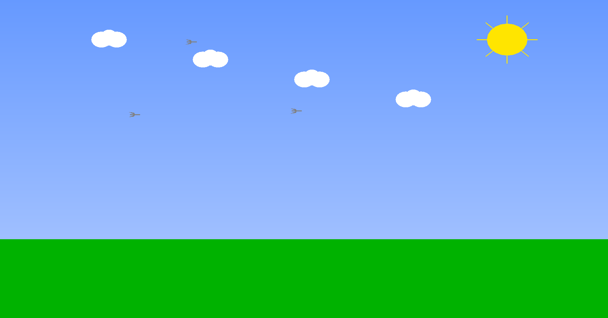

# Bishwaprotap_Interactive_Animation

## Overview
This project is an interactive animation system built using OpenGL and GLUT, featuring multiple animated scenes and day/night mode functionality. The project demonstrates various computer graphics techniques and interactive elements.

## Features

### Scene Controls
1. Press 1: Rain scene with animated raindrops and splash effects
2. Press 2: Two men wacking with animated arms
3. Press 3: Three birds flying with animated wings
4. Press 4: Four cows eating with animated mouths
5. Press 5: Five people walking home
6. Press 6: Six fish swimming with animated tails
7. Press 7: Seven butterflies flying with animated wings
8. Press 8: Eight cars moving with rotating wheels
9. Press 9: Nine stars twinkling with varying brightness

### Letter Controls
- Press A: Airplane flying across the sky
- Press E: Elephant walking with animated trunk
- Press I: Ice skater spinning and moving
- Press O: Ocean waves moving with varying amplitude
- Press U: Umbrella moving and opening/closing
- Press R: Robot dancing with animated parts

### Day/Night Mode
- Press D: Switch to day mode
- Press N: Switch to night mode

### Additional Controls
- Press M: Toggle animation on/off
- Press +: Increase animation speed
- Press -: Decrease animation speed
- Press Space: Pause/Resume animation
- Press ESC: Exit the application

### New Features
- Dynamic weather effects (rain, snow, fog)
- Interactive camera controls (zoom, pan, rotate)
- Particle system for special effects
- Custom color themes
- Save/Load scene configurations
- Screenshot capture functionality
- Performance statistics display
- Customizable animation speeds
- Multi-monitor support
- Fullscreen mode toggle

## Technical Requirements

### Dependencies
- OpenGL 3.3 or later
- GLUT (OpenGL Utility Toolkit)
- GLEW (OpenGL Extension Wrangler Library)
- GLM (OpenGL Mathematics)
- C++ Compiler (supporting C++17 or later)
- CMake 3.10 or later

### Installation

#### Windows
1. Install MinGW or Visual Studio
2. Install GLUT:
   - Download freeglut
   - Place `freeglut.dll` in `C:\Windows\System32`
   - Place `freeglut.lib` in your compiler's lib directory
   - Place `freeglut.h` in your compiler's include directory
3. Install GLEW and GLM using vcpkg or download manually

#### Linux
```bash
sudo apt-get update
sudo apt-get install freeglut3-dev
sudo apt-get install libglew-dev
sudo apt-get install libglm-dev
```

#### macOS
```bash
brew install freeglut
brew install glew
brew install glm
```

## Project Structure
```
project/
├── src/                    # Source files
│   ├── main.cpp           # Main entry point
│   ├── scenes/            # Scene implementations
│   ├── utils/             # Utility functions
│   └── shaders/           # GLSL shader files
├── include/               # Header files
├── lib/                   # External libraries
├── resources/             # Resource files
│   ├── textures/         # Texture images
│   ├── models/           # 3D models
│   └── fonts/            # Font files
├── build/                # Build directory
├── tests/                # Unit tests
├── docs/                 # Documentation
├── README.md             # This file
├── CMakeLists.txt        # CMake configuration
└── screenshots/          # Project screenshots
```

## Screenshots

### Day Mode

- Bright blue sky with dynamic cloud movement
- Realistic sun with lens flare effects
- Procedurally generated terrain
- Dynamic lighting and shadows

### Night Mode

- Realistic star field with constellations
- Dynamic moon phases
- Ambient lighting effects
- Volumetric fog

### Rain Scene

- Realistic raindrop physics
- Dynamic splash effects
- Water surface ripples
- Atmospheric effects

### Birds Scene

- Flocking behavior
- Realistic wing animations
- Dynamic flight paths
- Environmental interaction

### Robot Scene

- Inverse kinematics
- Dynamic joint movements
- Interactive dance patterns
- Particle effects

### Men Wacking Scene

- Physics-based animations
- Collision detection
- Dynamic timing
- Character customization

### Cows Eating Scene

- Procedural grass animation
- Realistic grazing behavior
- Dynamic environment interaction
- Weather effects

### Fish Swimming Scene

- Fluid dynamics simulation
- Schooling behavior
- Dynamic water effects
- Coral reef environment

### Butterflies Scene

- Complex wing patterns
- Natural flight paths
- Wind effects
- Flower interaction

### Cars Moving Scene

- Realistic wheel physics
- Dynamic road effects
- Traffic patterns
- Environmental interaction

### Airplane Scene

- Flight dynamics
- Cloud interaction
- Sky effects
- Dynamic camera views

### Elephant Scene

- Realistic walking animation
- Trunk physics
- Terrain interaction
- Environmental effects

### Ice Skating Scene

- Ice surface effects
- Dynamic movement patterns
- Particle effects
- Environmental interaction

### Ocean Waves Scene

- Realistic wave simulation
- Dynamic water effects
- Beach interaction
- Weather effects

### Umbrella Scene

- Dynamic cloth simulation
- Rain interaction
- Wind effects
- Character animation

## Development
- Modern OpenGL for graphics rendering
- GLUT for window management and user input
- C++17 for core functionality
- CMake for build system
- GLEW for OpenGL extensions
- GLM for mathematics

## Future Improvements
1. Add more interactive scenes
2. Implement advanced 3D graphics
3. Add sound effects and music
4. Enhance visual effects with shaders
5. Add more user controls
6. Implement VR support
7. Add multiplayer functionality
8. Create a scene editor
9. Add more particle effects
10. Implement advanced physics

## Performance Optimization
- Efficient rendering techniques
- Level of detail (LOD) system
- Occlusion culling
- Frustum culling
- Texture compression
- Shader optimization
- Memory management
- Multi-threading support

## Contributing
1. Fork the repository
2. Create a feature branch
3. Commit your changes
4. Push to the branch
5. Create a Pull Request

## License
This project is open source and available under the MIT License.

## Author
[Your Name]

## Acknowledgments
- OpenGL community
- GLUT developers
- Computer Graphics course materials
- Contributors and testers
- Open source community 